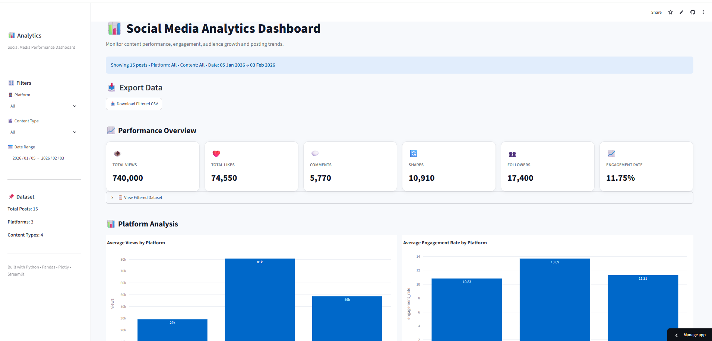

# 📊 Social Media Analytics Dashboard

An interactive Data Science dashboard built with Python, Pandas, Plotly, and Streamlit to analyze social media performance and discover actionable insights from content data.

---

## 🌐 Live Demo

🔗 [Open the Live Dashboard](https://social-media-analytics-dashboard-jmdpqybjvpxf5xedgjnngu.streamlit.app/)

## 📸 Dashboard Preview




## 🚀 Project Overview

Social media platforms generate a large amount of performance data such as views, likes, comments, shares, followers, posting time, and content type.

This project transforms raw social media data into an interactive dashboard that helps identify:

- Best-performing platforms
- Most effective content types
- Best posting days
- Best posting hours
- Engagement trends
- Top-performing posts
- Low-performing posts
- Hashtag performance
- Follower growth
- Relationship between views and engagement
- Engagement contribution from likes, comments, and shares

The dashboard also provides automated data-driven insights and recommendations.

---

## 🎯 Objectives

The main objectives of this project are:

1. Clean and prepare social media data.
2. Perform Exploratory Data Analysis (EDA).
3. Calculate important performance metrics.
4. Analyze platform and content performance.
5. Visualize trends using interactive charts.
6. Build an interactive Streamlit dashboard.
7. Generate automated insights from the analyzed data.
8. Allow users to filter and export the analyzed dataset.

---

## 🛠️ Technologies Used

- Python
- Pandas
- NumPy
- Plotly
- Streamlit
- CSV
- Git
- GitHub

---

## 📂 Project Structure

```text
Social-Media-Analytics-Dashboard/
│
├── data/
│   └── social_media_data.csv
│
├── src/
│
├── app.py
├── README.md
├── requirements.txt
└── .gitignore

